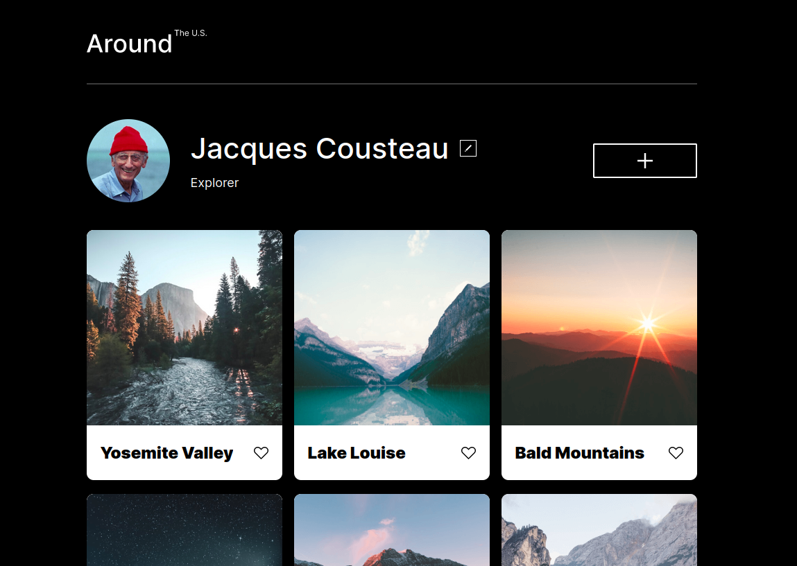
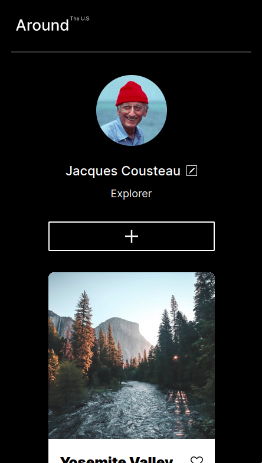

# Project 3: Around The U.S.

A responsive html/css page that displays a single user profile and multiple locations that user has added. Includes buttons for changing user's name, adding a new location, or liking/saving a location but no actions on button click.

## GitHub Pages Link

[View Project](https://mejohn.github.io/se_project_aroundtheus/)

## Screenshots

Desktop Resolution Screenshot

Mobile Resolution Screenshot

### Overview  

* Intro  
* Figma  
* Images  
  
**Intro**
  
This project is made so all the elements are displayed correctly on popular screen sizes. We recommend investing more time in completing this project, since it's more difficult than previous ones.  
  
**Figma**  
  
* [Link to the project on Figma](https://www.figma.com/file/ii4xxsJ0ghevUOcssTlHZv/Sprint-3%3A-Around-the-US?node-id=0%3A1)  
  
**Images**  
  
The way you'll do this at work is by exporting images directly from Figma — we recommend doing that to practice more. Don't forget to optimize them [here](https://tinypng.com/), so your project loads faster. 
  
Good luck and have fun!
